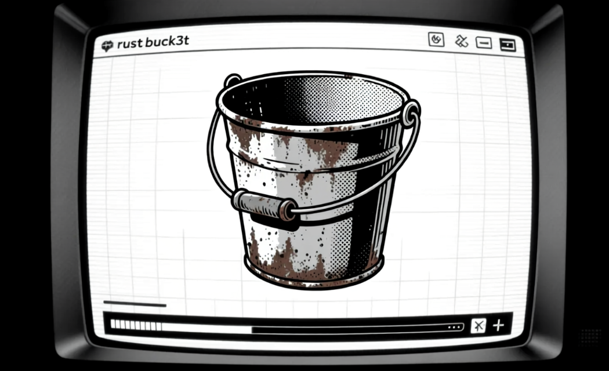

# rust-buck3t-ui



A rust [Actix Web](https://actix.rs/) client that acts as a proxy for [rust-buck3t](https://github.com/E10H1M/rust-buck3t).
Something for the non CLI savy but also to help flesh out debugging and development of the tool at a faster speed.


## Quickstart

```bash
# run (defaults to ./data)
cargo run

# or choose a data dir
RUST_BUCKET_IP=some_up cargo run
```


## Installing the `requirements`
Some requiremnts for linux:
- pkg-config
- libssl-dev
```
sudo apt update
sudo apt install pkg-config libssl-dev
```

## Installing Rust
```
1) Download install script and follow the commands:
curl --proto '=https' --tlsv1.2 -sSf https://sh.rustup.rs | sh
2) Add to path:
. "$HOME/.cargo/env"    
3) Then verify via: 
rustc --version
cargo --version
```

## Building the project
To build the rust project you would run this command:
```
cargo build
```


## 📜 License
Licensed under the [MIT](./LICENSE) license. Go make monies. <br>
Just mention me and include my license, k? (゜- ゜) 
